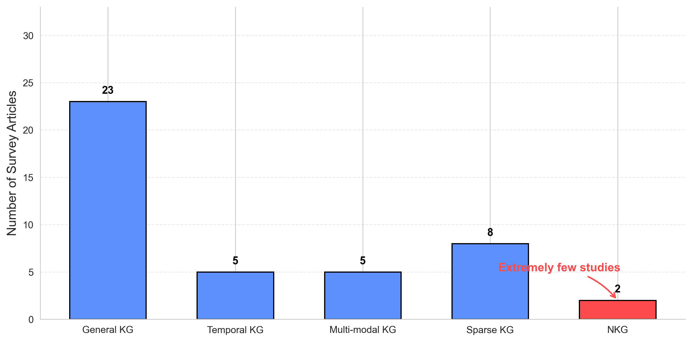

# 💥A Survey of Link Prediction in N-ary Knowledge Graphs

This is the repository for the survey paper: A Survey of Link Prediction in N-ary Knowledge Graphs. Recent efforts have increasingly focused on link prediction in NKGs.

  

 

Despite the rapid development of link prediction methods for NKGs, with nearly 50 methods proposed, existing surveys only briefly mention it, lacking a comprehensive and in-depth analysis. More statistics of existing surveys are related to traditional KGs, including general KG, temporal KG, etc. Therefore, we completed this survey of link prediction in NKGs.

  

 

## 🚀 Preliminary

### 🌟 Definition
**KG**: A traditional structure consisting of binary facts (triples) of the form , linking a head entity to a tail entity via a relation.

**NKG**: A generalized structure that supports n-ary facts, each involving more than two entities, allowing richer semantic representation.

**Link Prediction in NKGs**: The task of inferring missing entities or roles in existing n-ary facts.

### 🔍 Formalizations of N-ary Facts
**Hyperedge formalization**: Represents facts as fixed-size, ordered tuples.

**Role-value pair formalization**: Represents facts as unordered sets of role-entity mappings.

**Hyper-relational formalization**: Represents facts as a primary triple with additional qualifiers.

  

 

## ❤️ Recap of Methods

We investigate **three** types of link prediction methods in NKGs: Spatial Mapping-based Methods, Tensor Decomposition-based Methods, and Neural Network-based Methods.

- **Spatial Mapping-based Methods:** These methods map entities into a shared embedding space, enforcing geometric constraints to ensure meaningful spatial relationships among them. They can be further divided into three types based on the embedding space: Euclidean, hyperbolic, and complex space-based methods.
- **Tensor Decomposition-based Methods:** Such methods represent the set of facts in an NKG as a high-order tensor, where each tensor entry indicates the truth value of a particular fact. By reconstructing, decomposing, and optimizing this tensor, the model uncovers latent pattern features among the elements of n-ary facts, thereby enhancing link prediction accuracy.
- **Neural Network-based Methods:** These methods leverage neural networks to encode NKGs and perform link prediction with learned element representations. They can be categorized into four types: FCN-based, CNNbased, Transformer-based, and GNN-based methods. Each type employs a corresponding neural network architecture to encode n-ary facts.

  

 

## 🚀 Table of Contents

- [Type I: Spatial Mapping-based Methods](#type-i-context-memory-conflict)
  - [I-i: Euclidean Space-based Methods](#i-i-causes)
  - [I-ii: Hyperbolic Space-based Methods](#i-ii-behavior-analysis)
  - [I-iii: Complex Space-based Methods](#i-iii-mitigating-solutions)
- [Type II: Tensor Decomposition-based Methods](#type-ii-inter-context-conflict)
- [Type III: Neural Network-based Methods](#type-iii-intra-memory-conflict)
  - [III-i: FCN-based Methods](#iii-i-causes)
  - [III-ii: CNN-based Methods](#iii-ii-behavior-analysis)
  - [III-iii: Transformer-based Methods](#iii-iii-mitigating-solutions)
  - [III-iv: GNN-based Methods](#iii-iii-mitigating-solutions)

## Type I: Spatial Mapping-based Methods

### I-i: Euclidean Space-based Methods

1. On the representation and embedding of knowledge bases beyond binary relations, _Wen et al._, **IJCAI 2016**, [[Paper](https://www.ijcai.org/Proceedings/16/Papers/188.pdf)]
2. Scalable instance reconstruction in knowledge bases via relatedness affiliated embedding, _Zhang et al._, **WWW 2018**, [[Paper](https://dl.acm.org/doi/pdf/10.1145/3178876.3186017)]

### I-ii: Hyperbolic Space-based Methods](#i-ii-behavior-analysis)

1. Hyper2: Hyperbolic embedding for hyper-relational link prediction, _Yan et al._, **Neurocomputing 2022**, [[Paper](https://dl.acm.org/doi/10.1016/j.neucom.2022.04.026)]
2. Polygone: Modeling n-ary relational data as gyro-polygons in hyperbolic space, _Yan et al._, **AAAI 2022**, [[Paper](https://ojs.aaai.org/index.php/AAAI/article/view/20351)]
3. Modeling nary relational data as gyro-polygons with learnable gyro-centroid, _Yan et al._, **KBS 2022**, [[Paper](https://www.researchgate.net/publication/361299969_Modeling_N-ary_relational_data_as_gyro-polygons_with_learnable_gyro-centroid)]

### I-iii: Complex Space-based Methods
1. Shrinking embeddings for hyperrelational knowledge graphs, Xiong_ et al._, **ACL 2023**, [[Paper](https://aclanthology.org/2023.acl-long.743.pdf)]
2. Hypermono: A monotonicity-aware approach to hyper-relational knowledge representation, _Hu et al._, **Arxiv 2024**, [[Paper](https://arxiv.org/pdf/2404.09848)]

## Type II: Tensor Decomposition-based Methods
1. Knowledge hypergraphs: prediction beyond binary relations, _Fatemi et al._, **IJCAI 2021**, [[Paper](https://www.ijcai.org/proceedings/2020/0303.pdf)]
2. Generalizing tensor decomposition for n-ary relational knowledge bases, _Liu et al._, **WWW 2020**, [[Paper](https://dl.acm.org/doi/pdf/10.1145/3366423.3380188)]
3. Searching to sparsify tensor decomposition for n-ary relational data, _Di et al._, **WWW 2021**, [[Paper](https://dl.acm.org/doi/pdf/10.1145/3442381.3449853)]

## Type III: Neural Network-based Methods

### I-i: FCN-based Methods
1. Link prediction on n-ary relational data, _Guan et al._, **WWW 2019**, [[Paper](https://dl.acm.org/doi/pdf/10.1145/3308558.3313414)]
2. Neuinfer: Knowledge inference on n-ary facts, _Guan et al._, **ACL 2020**, [[Paper](https://aclanthology.org/2020.acl-main.546.pdf)]
3. Link prediction on n-ary relational data based on relatedness evaluation, _Guan et al._, **TKDE 2021**, [[Paper](https://www.computer.org/csdl/journal/tk/2023/01/09405412/1sP15eLr8s0)]

### I-ii: CNN-based Methods
1. Beyond triplets: hyper-relational knowledge graph embedding for link prediction, _Rosso et al._, **WWW 2020**, [[Paper](https://exascale.info/assets/pdf/rosso2020www.pdf)]
2. Schema-aware hyper-relational knowledge graph embeddings for link prediction, _Lu et al._, **TKDE 2023**, [[Paper](https://ieeexplore.ieee.org/document/10291001)]
3. Role-aware modeling for n-ary relational knowledge bases, _Liu et al._, **WWW 2021**, [[Paper](https://dl.acm.org/doi/pdf/10.1145/3442381.3449874)]
4. Enhance: Enhanced entity and relation embedding for knowledge hypergraph link prediction, _Wang et al._, **WWW 2023**, [[Paper](https://dl.acm.org/doi/pdf/10.1145/3543873.3587326)]
5. Hyconve: A novel embedding model for knowledge hypergraph link prediction with convolutional neural networks, _Wang et al._, **WWW 2023**, [[Paper](https://dl.acm.org/doi/pdf/10.1145/3543507.3583256)]
6. Hje: joint convolutional representation learning for knowledge hypergraph completion, _Li et al._, **TKDE 2024**, [[Paper](https://ieeexplore.ieee.org/stamp/stamp.jsp?tp=&arnumber=10436025)]
7. Hycube: Efficient knowledge hypergraph 3d circular convolutional embedding, _Li et al._, **TKDE 2024**, [[Paper](https://dl.acm.org/doi/10.1109/TKDE.2025.3531372)]

### I-iii: Transformer-based Methods
1. Improving hyper-relational knowledge graph completion, _Yu et al._, **DASFAA 2023**, [[Paper](https://dl.acm.org/doi/abs/10.1007/978-3-031-30672-3_51)]
2. Link prediction on n-ary relational facts: A graph-based approach, _Wang et al._, **ACL 2021**, [[Paper](https://aclanthology.org/2021.findings-acl.35.pdf)]
3. Representation learning on hyperrelational and numeric knowledge graphs with transformers, _Chung et al._, **SIGKDD 2023**, [[Paper](https://dl.acm.org/doi/pdf/10.1145/3580305.3599490)]
4. Integrating structure and text for enhancing hyper-relational knowledge graph representation via structure soft prompt tuning, _Li et al._, **CIKM 2024**, [[Paper](https://dl.acm.org/doi/pdf/10.1145/3627673.3679698)]
5. Robust link prediction over noisy hyper-relational knowledge graphs via active learning, _Yu et al._, **WWW 2024**, [[Paper](https://dl.acm.org/doi/pdf/10.1145/3589334.3645686)]

### I-iv: GNN-based Methods
1. Message passing for hyper-relational knowledge graphs, _Galkin et al._, **EMNLP 2020**, [[Paper](https://aclanthology.org/2020.emnlp-main.596.pdf)]
2. Learning representations for hyperrelational knowledge graphs, _Shomer et al._, **ASONAM 2023**, [[Paper](https://dl.acm.org/doi/pdf/10.1145/3625007.3627591)]
3. Hahe: Hierarchical attention for hyper-relational knowledge graphs in global and local level, _Luo et al._, **ACL 2023**, [[Paper](https://aclanthology.org/2023.acl-long.450.pdf)]
4. Hyperformer: Enhancing entity and relation interaction for hyperrelational knowledge graph completion, _Hu et al._, **CIKM 2023**, [[Paper](https://arxiv.org/pdf/2308.06512)]
5. Message function search for knowledge graph embedding, _Di et al._, **CIKM 2023**, [[Paper](https://dl.acm.org/doi/pdf/10.1145/3543507.3583546)]
6. Dhge: dualview hyper-relational knowledge graph embedding for link prediction and entity typing, _Luo et al._, **AAAI 2023**, [[Paper](https://dl.acm.org/doi/10.1609/aaai.v37i5.25795)]
7. Helios: Hyper-relational schema modeling from knowledge graphs, _Lu et al._, **MM 2023**, [[Paper](https://dl.acm.org/doi/pdf/10.1145/3581783.3612184)]
8. Hypercl: A contrastive learning framework for hyper-relational knowledge graph embedding with hierarchical ontology, _Lu et al._, **ACL 2024**, [[Paper](https://aclanthology.org/2024.findings-acl.171.pdf)]
9. Temporal knowledge graph reasoning based on n-tuple modeling, _Hou et al._, **EMNLP 2023**, [[Paper](https://aclanthology.org/2023.findings-emnlp.77/)]
10. Exploring link prediction over hyper-relational temporal knowledge graphs enhanced with time-invariant relational knowledge, _Ding et al._, **EMNLP 2024**, [[Paper](https://aclanthology.org/2024.findings-emnlp.20.pdf)]
11. Improving inductive link prediction using hyper-relational facts, _Ali et al._, **IJCAI 2022**, [[Paper](https://www.ijcai.org/proceedings/2022/0731.pdf)]
12. Inductive link prediction in n-ary knowledge graphs, _Wei et al._, **COLING 2025**, [[Paper](https://aclanthology.org/2025.coling-main.595.pdf)]
13. Inductive link prediction on n-ary relational facts via semantic hypergraph reasoning, _Yin et al._, **SIGKDD 2025**, [[Paper](https://dl.acm.org/doi/10.1145/3690624.3709195)]
14. When true becomes false: Few-shot link prediction beyond binary relations through mining false positive entities, _Zhang et al._, **MM 2022**, [[Paper](https://dl.acm.org/doi/pdf/10.1145/3503161.3547981)]
15. Few-shot link prediction on n-ary facts., _Wei et al._, **COLING 2024**, [[Paper](https://aclanthology.org/2024.lrec-main.632.pdf)]
